The Genetic Art Project was an experiment in algorithmic art, images "bred" from other images. It was based on the *International Genetic Art II* site (by John Mount, Scott Neal Reilly  and Michael Witbrock) which ran from 1994 through 1996.  This site, in turn, was inspired by the work of Scott Neal Reilly which itself drew inspiration from Karl Sims.  The current code can be found [here](https://github.com/JohnMount/Gart).

[**Read about the history of the Genetic Art Project**](history.md)

Click a thumbnail for a larger image.

<table>

<tr>
<td>
<a href="files/page5-1000-full.html">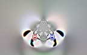</a>
</td>
<td>
<a href="files/page5-1001-full.html">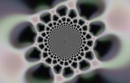</a>
</td>
<td>
<a href="files/page5-1002-full.html">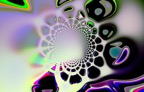</a>
</td>
<td>
<a href="files/page5-1003-full.html">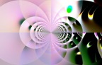</a>
</td>
</tr>

<tr>
<td>
<a href="files/page5-1004-full.html">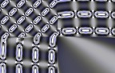</a>
</td>
<td>
<a href="files/page5-1005-full.html">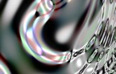</a>
</td>
<td>
<a href="files/page5-1006-full.html">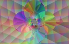</a>
</td>
<td>
<a href="files/page5-1007-full.html">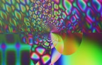</a>
</td>
</tr>

<tr>
<td>
<a href="files/page5-1008-full.html">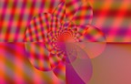</a>
</td>
<td>
<a href="files/page5-1009-full.html">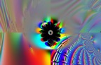</a>
</td>
<td>
<a href="files/page5-1010-full.html">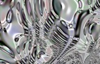</a>
</td>
<td>

</td>
</tr>

<tr>
<td>
<a href="files/page5-1012-full.html">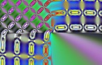</a>
</td>
<td>
<a href="files/page5-1013-full.html">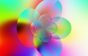</a>
</td>
<td>
<a href="files/page5-1014-full.html">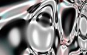</a>
</td>
<td>
<a href="files/page5-1015-full.html">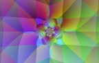</a>
</td>
</tr>

<tr>
<td>

</td>
<td>
<a href="files/page5-1017-full.html">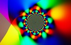</a>
</td>
<td>
<a href="files/page5-1018-full.html">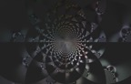</a>
</td>
<td>
<a href="files/page5-1019-full.html">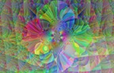</a>
</td>
</tr>

</table>