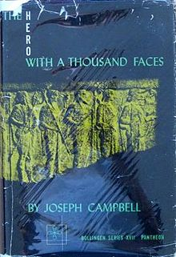
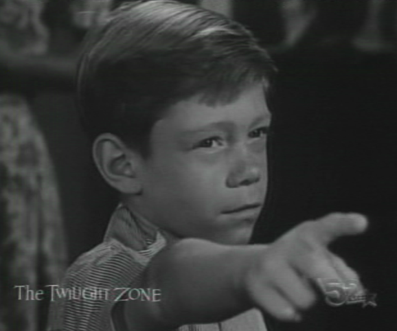
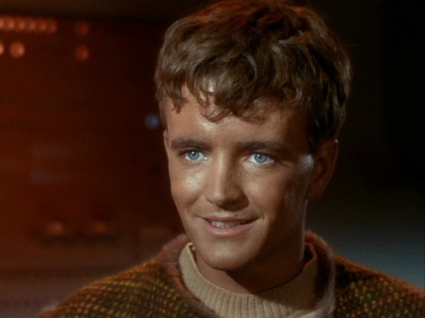
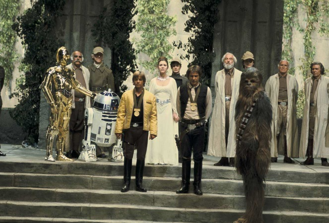
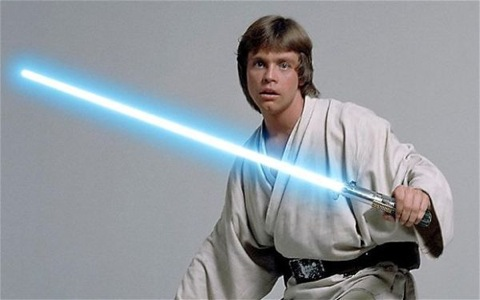
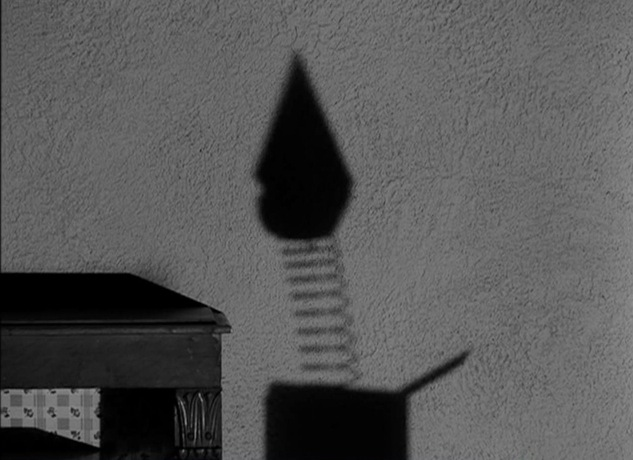
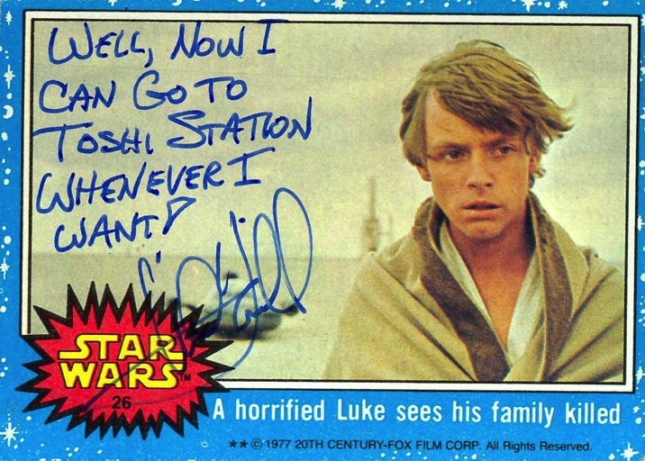

# *Star Wars* 1977:  It's a Good Life

It has been for long while fashionable among nerds to try to trace the influence of Joseph Campbell's *The Hero With a Thousand Faces* on 1977's *Star Wars*. *Star Wars* gets to sound a little more cultured and the speaker gets to try to look smart.

  

The traditional summary of the monomyth theory is:

<blockquote>A hero ventures forth from the world of common day into a region of supernatural wonder: fabulous forces are there encountered and a decisive victory is won: the hero comes back from this mysterious adventure with the power to bestow boons on his fellow man.</blockquote>

(Campbell, taken from <a href="https://en.wikipedia.org/wiki/The_Hero_with_a_Thousand_Faces#Summary"><em>The Hero with a Thousand Faces</em></a>))
 

Campbell also appears in various snippets where the *Hero With a Thousand Faces* / *Star Wars* claim is made, but we can assume he is lending Lucas some gravitas in exchange for adoration.

A number of truly smart commentators have pointed out the monomyth is not in fact a good summary of *Star Wars 1977* (anything by Bob "MovieBob" Chipman, for example:
[Destined for Disappointment - part 2](http://www.escapistmagazine.com/videos/view/the-big-picture/9004-Destined-for-Disappointment-Part-2)).  The main character Luke doesn't achieve enlightenment in the first movie, doesn't share boons, and doesn't return home Odyssey/StarChild style.  For the larger movie arc you can argue the Empire are plausibly the lesser bad guys ([see](http://www.weeklystandard.com/Content/Public/Articles/000/000/001/248ipzbt.asp)) or even the entire arc is a plot by the Skywalker family to rule ([the entire conflict being a ruse](https://www.youtube.com/watch?v=kN9LdTkR85Q)).

So what is the actual story of 1977's *Star Wars* (assuming we look only at that movie and no further material)?  The answer is: thinly veiled patricide fantasies (for a good analysis of this type see: [*A Little More than Kin, and Less than Kind*](https://multoghost.wordpress.com/2012/01/03/a-little-more-than-kin-and-less-than-kind/)).

Here is one possible summary of *Star Wars 1977*:  

<blockquote>Luke Skywalker, who is an orphan, lives with his aunt and uncle.  His aunt and uncle die with grisly burns  soon after arguing with Luke about Luke going to school.  
  
Luke then flees his home planet with new friends including a kind uncle type named Obi-Wan Kenobi.  Obi-Wan speaks of paranormal powers and is in turn killed by somebody named Darth Vader (who himself has telekinetic powers and wears a life support suit due to severe burns).  
  
Both Luke and Han Solo seem to have a romantic interest in Princess Leia and try to impress her by helping her rebellion cell.  Han comes to realize the danger of being a romantic rival of Luke and leaves the rebellion on a pretext.  In the rebellion's major military strike pilots more experienced than Luke all fail and die, leaving the opportunity for glory entirely to Luke.  
  
Han returns (obviously afraid of the consequences of having left Luke on bad terms) to save Luke who then completes the mission solo (magnanimously waving his escort fighters off).  Darth Vader lives because Luke lost track of him.  
  
Leia (now obviously aware on some level of Luke's paranormal powers and how they have been gruesomely channeling events) throws an over the top celebration awarding many medals and a kiss to Luke.  Everybody makes a very nervous show of appearing to be very happy about the situation, and very happy with Luke.</blockquote> 

We have a lot of thinly encoded patricides: Luke's original parents, Luke's aunt and Uncle, Luke's pseudo-uncle Obi-Wan Kenobi,  Darth Vader's injuries (Vader being a likely relative of Luke's- assuming the paranormal powers are somehow related to family), and the many pilots in Luke's adoptive rebel family.  We also have an ending straight out the *Twilight Zone*'s "It's a Good Life" ([1961](https://en.wikipedia.org/wiki/It's_a_Good_Life_(The_Twilight_Zone))).  Characters suspect Luke has extraordinary paranormal powers and great potential to harm them (either intentionally or subconsciously).

The final *Star Wars* celebration is very much of the tone "It's *good* Luke blew up the Death Star.  Don't you think it is *good* Luke blew up the Death Star?"  Where poor mortal pawns are hoping to delay incurring Luke's wrath through copious praise.

Luke's romantic attraction to Leia brings in elements of Star Trek's Charlie X ([1966](https://en.wikipedia.org/wiki/Charlie_X)). Luke doesn't so much blow up the Death Star to defeat the Empire (which had barely deployed this new unit), but to impress his current crush: Leia.

At the end of *Star Wars 1977* Luke isn't going home to Tatooine, he hasn't learned much (despite what characters claim, his power is innate, not learned), and he has no wisdom to share with his fellow man.  We don't see any boons granted, just a lot of death.  At the end of *Star Wars 1977* just about anyone who could discipline Luke is dead (through his paranormal manipulation, either conscious or unconscious) and the few that are left are throwing a celebration in his honor to try and keep his favor.

But how long can everybody think enough happy thoughts?

 

Found a cool "It's a Good Life" Luke mashup <a href="https://www.youtube.com/watch?v=YTymEgv-MK4" rel="self">here</a>.

